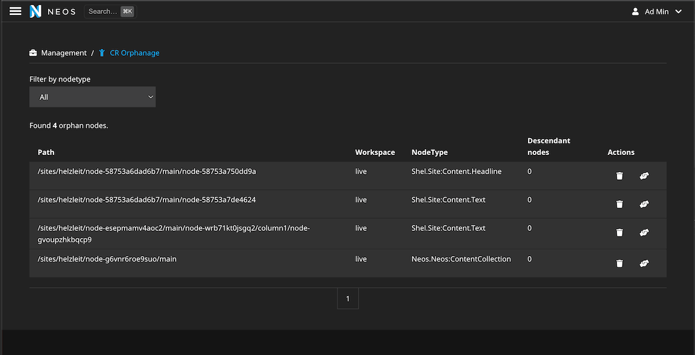

# Orphan node handling for Neos CMS

This package provides a backend module to handle orphan nodes in Neos CMS 8.3 & 8.4.

⚠️ This package currently only works properly with this [Neos patch](https://github.com/neos/neos-development-collection/pull/5179).

## Screenshot



## Installation

Run the following command in your Neos project:

```shell
composer require shel/neos-orphanage
```

Or add the package as dependency to your site-package.

## Usage

You can access the orphanage module in the Neos backend under the "Management" section.

There you can currently either delete or adopt orphan nodes.

### Adopting nodes

To adopt orphan nodes you will first need to allow the new document type 
`Shel.Neos.Orphanage:Document.Orphanage` to be created via constraints. F.e. on your homepage node.

Afterwards, orphan nodes can be adopted an will automatically be moved to the new page.

## Open tasks

- [ ] Get Neos patch merged and set as next Neos Version as minimal dependency after release
- [ ] Improve HTMX usage and integration
  - [ ] Prevent missing styles after reloading the module after paginating 
- [ ] Link orphanage node in module and show hint if none exists
- [ ] Allow searching for node identifiers

## Contribute

Contributions are very welcome.

For code contributions, please create a fork and create a PR against the lowest maintained
branch of this repository (currently `main`).

## License

See [License](LICENSE.txt)
